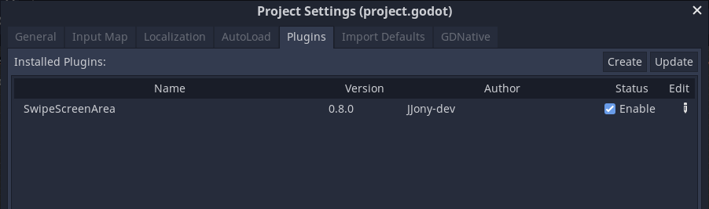
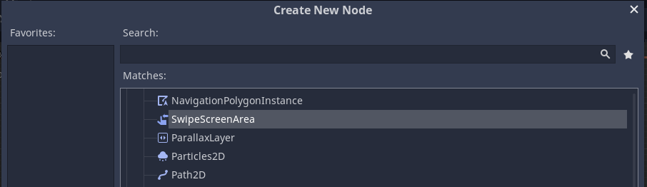
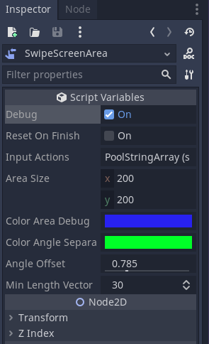
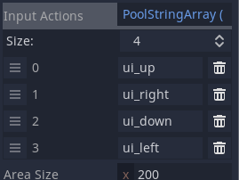

# Godot Swipe Screen Area Plugin

# Description

This plugin add a Node to manage discrete swipes on touchscreens devices as Input actions.

# How to use
> extract swipe_controller folder inside the res://addons directory on your Godot project.

> open Project > Project Settings and select Plugin tab. Check enable to activate the plugin.\n

> add an SwipeScreenArea to your scene.

> If want to test on Desktop environment open Project > Project Settings > Pointing and check Emulate Touch From Mouse option.

# SwipeScreenArea node

You can configure some variables inside inspector

> Debug: Enable draw references in execution.

> Reset on finish: If is checked, scan next swipe after detect the last.

> Input Actions: The swipe's actions (input actions events defined in Input Map).

> Area size: Size of area detection swipe in px.

> Color area debug: Set color of size area reference.

> Color angle separator: Set color of swipes's directions separators.

> Angle offset: Change angle of swipes's directions detections.

> Min lenght vector: Define the distance amount to determine detected swipe.

## License

This plugin falls under the [MIT License](LICENSE)

